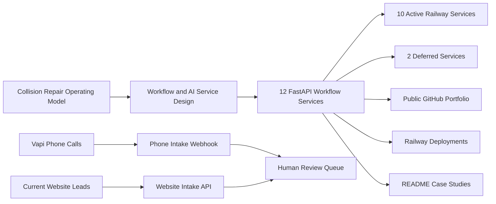

# Precision Auto Body Automation Portfolio

This roadmap coordinates the Precision Auto Body automation portfolio: 12 FastAPI workflow services, 10 active Railway deployments, one Vapi-powered phone intake automation, and one existing website-intake workflow service. The portfolio demonstrates how an AI deployment engineer can decompose a business into workflows, decisions, product boundaries, and production-style automation services.

## Why this portfolio matters

The work is intentionally broader than isolated AI demos. Each repo represents one operational slice of a collision shop: phone intake, website intake, scheduling, VIN normalization, estimate review, supplement evidence, customer updates, parts coordination, production management, insurance correspondence, and closeout. Together they form a practical reference implementation for workflow-centric AI deployment.

## Current launch status

- Local repos: complete
- Tests/lint/Docker: ready to run with `scripts/validate_all.sh`
- Screenshots: present in each repo under `docs/assets`
- GitHub publishing: complete
- Railway deployment: 10 active workflow services online; 2 services deferred
- Live phone automation: Vapi end-of-call reports create saved phone-intake records
- Website intake workflow: `collision-intake-api` remains the active current-website intake service
- Data policy: synthetic public demo data only

## Active Production Map

| Workflow lane | Active service | Trigger | Current role | Live status |
| --- | --- | --- | --- | --- |
| Phone calls | [collision-phone-intake-api](https://github.com/dkdejesus/collision-phone-intake-api) | Vapi `end-of-call-report` webhook | Converts call transcripts into structured phone intake records | Online |
| Current website leads | [collision-intake-api](https://github.com/dkdejesus/collision-intake-api) | Website/lead intake workflow | Existing deployed intake workflow for current website leads | Online |
| Scheduling | [collision-appointment-scheduler-api](https://github.com/dkdejesus/collision-appointment-scheduler-api) | Manual/API input for now | Appointment readiness and confirmation draft | Online |
| VIN support | [collision-vin-decoder-api](https://github.com/dkdejesus/collision-vin-decoder-api) | Manual/API input for now | VIN normalization and validation warnings | Online |
| Estimating | [collision-estimate-parser-api](https://github.com/dkdejesus/collision-estimate-parser-api) | Manual/API input for now | Estimate totals, missing fields, risk flags | Online |
| Repair order closeout | [collision-repair-order-summarizer-api](https://github.com/dkdejesus/collision-repair-order-summarizer-api) | Manual/API input for now | Internal/customer-safe RO summaries | Online |
| Supplements | [collision-supplement-evidence-api](https://github.com/dkdejesus/collision-supplement-evidence-api) | Manual/API input for now | Supplement narrative and evidence checklist | Online |
| Customer communication | [collision-customer-status-update-api](https://github.com/dkdejesus/collision-customer-status-update-api) | Manual/API input for now | Customer-safe update drafts and approval flags | Online |
| Parts | [collision-parts-eta-tracker-api](https://github.com/dkdejesus/collision-parts-eta-tracker-api) | Manual/API input for now | ETA risk, blockers, vendor follow-up draft | Online |
| Insurance | [collision-insurance-email-drafting-api](https://github.com/dkdejesus/collision-insurance-email-drafting-api) | Manual/API input for now | Adjuster follow-up draft and escalation context | Online |
| Production management | [collision-daily-production-dashboard-api](https://github.com/dkdejesus/collision-daily-production-dashboard-api) | Manual/API input for now | WIP summary, blockers, promised-date risk | Online |

## Portfolio Repository Index

| Area | Repository | Automation | Endpoint | Local status | GitHub | Railway |
| --- | --- | --- | --- | --- | --- | --- |
| Intake | [collision-phone-intake-api](https://github.com/dkdejesus/collision-phone-intake-api) | Phone intake with Vapi webhook | `POST /v1/webhooks/vapi/intake-call`; `POST /v1/phone-intakes` | Ready | Published | Online |
| Website intake | [collision-intake-api](https://github.com/dkdejesus/collision-intake-api) | Current website intake workflow | `POST /v1/intakes`; `POST /v1/intakes/assess` | Ready | Published | Online |
| Intake | [collision-appointment-scheduler-api](https://github.com/dkdejesus/collision-appointment-scheduler-api) | Appointment scheduler | `POST /v1/appointments` | Ready | Published | Online |
| Intake | [collision-vin-decoder-api](https://github.com/dkdejesus/collision-vin-decoder-api) | VIN decoder | `POST /v1/vin-decodes` | Ready | Published | Online |
| Estimating | [collision-estimate-parser-api](https://github.com/dkdejesus/collision-estimate-parser-api) | Estimate parser | `POST /v1/estimate-parses` | Ready | Published | Online |
| Closeout | [collision-repair-order-summarizer-api](https://github.com/dkdejesus/collision-repair-order-summarizer-api) | Repair-order summarizer | `POST /v1/repair-order-summaries` | Ready | Published | Online |
| Insurance | [collision-supplement-evidence-api](https://github.com/dkdejesus/collision-supplement-evidence-api) | Supplement evidence generator | `POST /v1/supplement-evidence` | Ready | Published | Online |
| Communications | [collision-customer-status-update-api](https://github.com/dkdejesus/collision-customer-status-update-api) | Customer status update agent | `POST /v1/status-updates` | Ready | Published | Online |
| Parts | [collision-parts-eta-tracker-api](https://github.com/dkdejesus/collision-parts-eta-tracker-api) | Parts ETA tracker | `POST /v1/parts-eta` | Ready | Published | Online |
| Insurance | [collision-insurance-email-drafting-api](https://github.com/dkdejesus/collision-insurance-email-drafting-api) | Insurance email drafting | `POST /v1/insurance-emails` | Ready | Published | Online |
| Production | [collision-daily-production-dashboard-api](https://github.com/dkdejesus/collision-daily-production-dashboard-api) | Daily production dashboard | `POST /v1/production-dashboards` | Ready | Published | Online |
| Production | [collision-technician-work-queue-api](https://github.com/dkdejesus/collision-technician-work-queue-api) | Technician work queue | `POST /v1/technician-work` | Ready | Published | Deferred |
| Delivery | [collision-delivery-readiness-api](https://github.com/dkdejesus/collision-delivery-readiness-api) | Delivery readiness checker | `POST /v1/delivery-readiness` | Ready | Published | Deferred |

## Architecture story

## Current Production Path

1. Vapi records and transcribes phone calls.
2. Vapi sends final `end-of-call-report` events to `collision-phone-intake-api`.
3. The phone-intake API creates saved structured intake records for staff review.
4. The existing `collision-intake-api` remains the workflow item for current website leads.
5. The other active services are online as workflow engines and need UI/review/integration layers before staff-wide production use.
6. The next major product layer is a private Precision Ops Console that lets staff review and act on saved API outputs without using raw JSON or Swagger.

## Guardrails

- Use only synthetic or fully sanitized data.
- Do not publish real customer names, phone numbers, emails, VINs, claim numbers, estimates, insurer files, or vehicle photos.
- Treat AI outputs as drafts, summaries, flags, checklists, and recommendations.
- Keep human approval required for safety, financial, insurance-facing, and customer-facing decisions.
