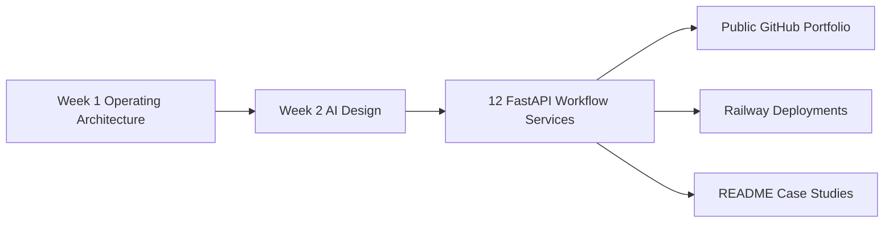

# Precision Auto Body Automation Portfolio

This roadmap coordinates 12 deployable FastAPI automation services built from a real collision-repair operating architecture. The portfolio demonstrates how an AI deployment engineer can decompose a business into workflows, decisions, product boundaries, and production-style automation services.

## Why this portfolio matters

The work is intentionally broader than isolated AI demos. Each repo represents one operational slice of a collision shop: intake, scheduling, VIN normalization, estimate review, supplement evidence, customer updates, parts coordination, production management, delivery readiness, insurance correspondence, and closeout. Together they form a practical reference implementation for workflow-centric AI deployment.

## Current launch status

- Local repos: complete
- Tests/lint/Docker: ready to run with `scripts/validate_all.sh`
- Screenshots: present in each repo under `docs/assets`
- GitHub publishing: pending `gh auth login`
- Railway deployment: pending dashboard deployment
- Data policy: synthetic public demo data only

## Repository index

| Area | Repository | Automation | Endpoint | Local status | GitHub | Railway |
|---|---|---|---|---|---|---|
| Intake | [collision-phone-intake-api](../collision-phone-intake-api) | Phone intake | `POST /v1/phone-intakes` | Ready | Pending | Pending |
| Intake | [collision-appointment-scheduler-api](../collision-appointment-scheduler-api) | Appointment scheduler | `POST /v1/appointments` | Ready | Pending | Pending |
| Intake | [collision-vin-decoder-api](../collision-vin-decoder-api) | VIN decoder | `POST /v1/vin-decodes` | Ready | Pending | Pending |
| Estimating | [collision-estimate-parser-api](../collision-estimate-parser-api) | Estimate parser | `POST /v1/estimate-parses` | Ready | Pending | Pending |
| Closeout | [collision-repair-order-summarizer-api](../collision-repair-order-summarizer-api) | Repair-order summarizer | `POST /v1/repair-order-summaries` | Ready | Pending | Pending |
| Insurance | [collision-supplement-evidence-api](../collision-supplement-evidence-api) | Supplement evidence generator | `POST /v1/supplement-evidence` | Ready | Pending | Pending |
| Communications | [collision-customer-status-update-api](../collision-customer-status-update-api) | Customer status update agent | `POST /v1/status-updates` | Ready | Pending | Pending |
| Parts | [collision-parts-eta-tracker-api](../collision-parts-eta-tracker-api) | Parts ETA tracker | `POST /v1/parts-eta` | Ready | Pending | Pending |
| Production | [collision-technician-work-queue-api](../collision-technician-work-queue-api) | Technician work queue | `POST /v1/technician-work` | Ready | Pending | Pending |
| Delivery | [collision-delivery-readiness-api](../collision-delivery-readiness-api) | Delivery readiness checker | `POST /v1/delivery-readiness` | Ready | Pending | Pending |
| Insurance | [collision-insurance-email-drafting-api](../collision-insurance-email-drafting-api) | Insurance email drafting | `POST /v1/insurance-emails` | Ready | Pending | Pending |
| Production | [collision-daily-production-dashboard-api](../collision-daily-production-dashboard-api) | Daily production dashboard | `POST /v1/production-dashboards` | Ready | Pending | Pending |

## Architecture story

## Build order

1. Polish all READMEs and screenshots.
2. Publish all 12 repos to GitHub after re-authentication.
3. Deploy each repo from GitHub to Railway.
4. Add live demo links back into each README and this roadmap.
5. Use this roadmap as the portfolio landing page.

## Guardrails

- Use only synthetic or fully sanitized data.
- Do not publish real customer names, phone numbers, emails, VINs, claim numbers, estimates, insurer files, or vehicle photos.
- Treat AI outputs as drafts, summaries, flags, checklists, and recommendations.
- Keep human approval required for safety, financial, insurance-facing, and customer-facing decisions.
