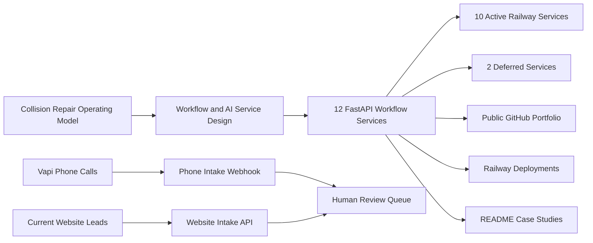

# Precision Auto Body Automation Portfolio

This roadmap coordinates the Precision Auto Body automation portfolio: 12 FastAPI workflow services, 10 active Railway deployments, one Vapi-powered phone intake automation, and one existing website-intake workflow service. The portfolio demonstrates how an AI deployment engineer can decompose a business into workflows, decisions, product boundaries, and production-style automation services.

## Why this portfolio matters

The work is intentionally broader than isolated AI demos. Each repo represents one operational slice of a collision shop: phone intake, website intake, scheduling, VIN normalization, estimate review, supplement evidence, customer updates, parts coordination, production management, insurance correspondence, and closeout. Together they form a practical reference implementation for workflow-centric AI deployment.

## Current launch status

- Local repos: complete
- Tests/lint/Docker: ready to run with `scripts/validate_all.sh`
- Screenshots: present in each repo under `docs/assets`
- GitHub publishing: complete
- Railway deployment: 10 active workflow services online; 2 services deferred
- Live phone automation: Vapi end-of-call reports create saved phone-intake records
- Website intake workflow: `collision-intake-api` remains the active current-website intake service
- Data policy: synthetic public demo data only

## Active Production Map

| Workflow lane | Active service | Trigger | Current role | Live status |
| --- | --- | --- | --- | --- |
| Phone calls | [collision-phone-intake-api](https://github.com/dkdejesus/collision-phone-intake-api) | Vapi `end-of-call-report` webhook | Converts call transcripts into structured phone intake records | Online |
| Current website leads | [collision-intake-api](https://github.com/dkdejesus/collision-intake-api) | Website/lead intake workflow | Existing deployed intake workflow for current website leads | Online |
| Scheduling | [collision-appointment-scheduler-api](https://github.com/dkdejesus/collision-appointment-scheduler-api) | Manual/API input for now | Appointment readiness and confirmation draft | Online |
| VIN support | [collision-vin-decoder-api](https://github.com/dkdejesus/collision-vin-decoder-api) | Manual/API input for now | VIN normalization and validation warnings | Online |
| Estimating | [collision-estimate-parser-api](https://github.com/dkdejesus/collision-estimate-parser-api) | Manual/API input for now | Estimate totals, missing fields, risk flags | Online |
| Repair order closeout | [collision-repair-order-summarizer-api](https://github.com/dkdejesus/collision-repair-order-summarizer-api) | Manual/API input for now | Internal/customer-safe RO summaries | Online |
| Supplements | [collision-supplement-evidence-api](https://github.com/dkdejesus/collision-supplement-evidence-api) | Manual/API input for now | Supplement narrative and evidence checklist | Online |
| Customer communication | [collision-customer-status-update-api](https://github.com/dkdejesus/collision-customer-status-update-api) | Manual/API input for now | Customer-safe update drafts and approval flags | Online |
| Parts | [collision-parts-eta-tracker-api](https://github.com/dkdejesus/collision-parts-eta-tracker-api) | Manual/API input for now | ETA risk, blockers, vendor follow-up draft | Online |
| Insurance | [collision-insurance-email-drafting-api](https://github.com/dkdejesus/collision-insurance-email-drafting-api) | Manual/API input for now | Adjuster follow-up draft and escalation context | Online |
| Production management | [collision-daily-production-dashboard-api](https://github.com/dkdejesus/collision-daily-production-dashboard-api) | Manual/API input for now | WIP summary, blockers, promised-date risk | Online |

## Portfolio Repository Index

| Area | Repository | Automation | Endpoint | Local status | GitHub | Railway |
| --- | --- | --- | --- | --- | --- | --- |
| Intake | [collision-phone-intake-api](https://github.com/dkdejesus/collision-phone-intake-api) | Phone intake with Vapi webhook | `POST /v1/webhooks/vapi/intake-call`; `POST /v1/phone-intakes` | Ready | Published | Online |
| Website intake | [collision-intake-api](https://github.com/dkdejesus/collision-intake-api) | Current website intake workflow | `POST /v1/intakes`; `POST /v1/intakes/assess` | Ready | Published | Online |
| Intake | [collision-appointment-scheduler-api](https://github.com/dkdejesus/collision-appointment-scheduler-api) | Appointment scheduler | `POST /v1/appointments` | Ready | Published | Online |
| Intake | [collision-vin-decoder-api](https://github.com/dkdejesus/collision-vin-decoder-api) | VIN decoder | `POST /v1/vin-decodes` | Ready | Published | Online |
| Estimating | [collision-estimate-parser-api](https://github.com/dkdejesus/collision-estimate-parser-api) | Estimate parser | `POST /v1/estimate-parses` | Ready | Published | Online |
| Closeout | [collision-repair-order-summarizer-api](https://github.com/dkdejesus/collision-repair-order-summarizer-api) | Repair-order summarizer | `POST /v1/repair-order-summaries` | Ready | Published | Online |
| Insurance | [collision-supplement-evidence-api](https://github.com/dkdejesus/collision-supplement-evidence-api) | Supplement evidence generator | `POST /v1/supplement-evidence` | Ready | Published | Online |
| Communications | [collision-customer-status-update-api](https://github.com/dkdejesus/collision-customer-status-update-api) | Customer status update agent | `POST /v1/status-updates` | Ready | Published | Online |
| Parts | [collision-parts-eta-tracker-api](https://github.com/dkdejesus/collision-parts-eta-tracker-api) | Parts ETA tracker | `POST /v1/parts-eta` | Ready | Published | Online |
| Insurance | [collision-insurance-email-drafting-api](https://github.com/dkdejesus/collision-insurance-email-drafting-api) | Insurance email drafting | `POST /v1/insurance-emails` | Ready | Published | Online |
| Production | [collision-daily-production-dashboard-api](https://github.com/dkdejesus/collision-daily-production-dashboard-api) | Daily production dashboard | `POST /v1/production-dashboards` | Ready | Published | Online |
| Production | [collision-technician-work-queue-api](https://github.com/dkdejesus/collision-technician-work-queue-api) | Technician work queue | `POST /v1/technician-work` | Ready | Published | Deferred |
| Delivery | [collision-delivery-readiness-api](https://github.com/dkdejesus/collision-delivery-readiness-api) | Delivery readiness checker | `POST /v1/delivery-readiness` | Ready | Published | Deferred |

## Architecture story



## Current Production Path

1. Vapi records and transcribes phone calls.
2. Vapi sends final `end-of-call-report` events to `collision-phone-intake-api`.
3. The phone-intake API creates saved structured intake records for staff review.
4. The existing `collision-intake-api` remains the workflow item for current website leads.
5. The other active services are online as workflow engines and need UI/review/integration layers before staff-wide production use.
6. The next major product layer is a private Precision Ops Console that lets staff review and act on saved API outputs without using raw JSON or Swagger.

## Automation Implementation Model

The APIs are the processing layer, not the whole automation. Each production automation should be implemented as a complete business loop:

```text
Trigger
-> Input capture
-> Normalization
-> Workflow API
-> Saved record
-> Human review
-> Approved action
-> Business system update
-> Measurement
```

Use this pattern for every workflow:

| Layer | Purpose | Precision examples |
| --- | --- | --- |
| Trigger | Starts the automation without staff opening Swagger | Vapi call ended, website lead submitted, Gmail received, Google Sheet row updated, daily schedule |
| Input capture | Collects the raw business artifact | Transcript, form lead, estimate text, RO notes, parts email, production sheet |
| Normalization | Converts messy input into a consistent request shape | Map transcript to intake notes, map CSV rows to jobs, map vendor email to part status |
| Workflow API | Produces structured operational output | Missing fields, risk flags, drafts, checklist, next action |
| Saved record | Creates an audit trail and reviewable history | SQLite now; shared Postgres later |
| Human review | Keeps safety, customer, insurance, and financial decisions approved by staff | Front desk, estimator, production manager, owner |
| Approved action | Turns the draft/recommendation into work | Customer message, appointment draft, supplement packet, vendor follow-up |
| Business system update | Moves approved info into operating systems | CCC ONE note, Gmail draft, Calendar event, QuickBooks reference, production board |
| Measurement | Proves whether the automation is worth keeping | Time saved, missing fields caught, callbacks reduced, cycle-time risk reduced |

The first real automated loop is already live:

```text
Customer call
-> Vapi transcript
-> collision-phone-intake-api webhook
-> saved phone intake
-> staff review
```

The remaining services are deployed workflow engines. They become true automations when they receive real triggers and route results into the Precision review/action layer.

## Deterministic Workflow vs AI Judgment

Production automation should combine deterministic workflow control with bounded AI judgment:

```text
Deterministic workflow = controls the process
AI judgment = interprets messy information
Human review = approves sensitive action
```

Use deterministic code for anything that must be predictable, auditable, and enforceable. Use AI for language-heavy interpretation, summarization, classification, and drafting. Do not use AI for control-plane decisions.

| Layer | Deterministic automation owns | AI judgment owns |
| --- | --- | --- |
| Trigger handling | Webhook validation, event filtering, duplicate handling, schedule execution | Nothing |
| Input preparation | Required metadata, source IDs, timestamps, request IDs, schema validation | Extracting meaning from messy transcripts, notes, emails, or estimate text |
| Business rules | Required-field checks, approval gates, routing, persistence, audit logs, status labels | Risk classification, draft language, summarization, missing-info suggestions |
| Sensitive actions | Human-review enforcement, no-auto-send rules, final approval state | Drafts and recommendations only |
| System updates | Creating saved records, Gmail drafts, Calendar drafts, future approved system writes | Suggested content for the deterministic action |

For the live Vapi phone intake workflow:

```text
Deterministic:
Vapi event received
-> check webhook secret
-> accept only end-of-call-report
-> extract transcript
-> create request_id

AI judgment:
Assess transcript for urgency, drivability caution, missing fields, next steps, and customer-ready draft

Deterministic:
Save result
-> return request_id
-> make record retrievable
-> require human review
```

Design rule: AI may draft, classify, summarize, flag, and recommend. Deterministic code must enforce the workflow gates. Humans approve safety, customer-facing, insurer-facing, financial, repair, and drivability decisions.

## Workflow Automation Reference

| Workflow | Trigger target | API | Review owner | Approved action | Production maturity |
| --- | --- | --- | --- | --- | --- |
| Phone intake | Vapi `end-of-call-report` webhook | `collision-phone-intake-api` | Front desk / estimator | Complete intake, request missing fields, decide next staff action | Automated trigger live |
| Website intake | Current website lead workflow | `collision-intake-api` | Front desk / estimator | Review lead assessment, follow up, create/continue intake | Active workflow item |
| Appointment scheduling | Intake marked appointment-ready | `collision-appointment-scheduler-api` | Front desk | Create Calendar draft or confirm appointment manually | Needs trigger + calendar draft layer |
| VIN support | Intake or estimate includes VIN | `collision-vin-decoder-api` | Estimator | Validate vehicle profile before estimate/research | Needs trigger from intake/estimate |
| Estimate review | Estimate text/PDF export uploaded or pasted | `collision-estimate-parser-api` | Estimator | Review totals, missing fields, calibration/OEM risk | Needs real parser inputs |
| RO summary | RO notes pasted or exported | `collision-repair-order-summarizer-api` | Estimator / manager | Create internal and customer-safe summary | Needs RO source workflow |
| Supplement evidence | Supplement candidate identified | `collision-supplement-evidence-api` | Estimator | Draft supplement narrative and evidence checklist | Needs photo/procedure/document handoff |
| Customer updates | Repair stage/blocker changed | `collision-customer-status-update-api` | CSR / estimator | Approve customer-safe update draft | Needs production-stage trigger |
| Parts ETA | Vendor status email or parts board update | `collision-parts-eta-tracker-api` | Parts coordinator | Escalate blockers, send vendor follow-up draft | Needs Gmail/parts-board trigger |
| Insurance email | Claim/supplement delay or adjuster follow-up needed | `collision-insurance-email-drafting-api` | Estimator | Approve adjuster email draft | Needs Gmail draft integration |
| Daily dashboard | Scheduled daily run or production sheet update | `collision-daily-production-dashboard-api` | Manager / owner | Set morning priorities and at-risk job list | Needs shared production data source |
| Technician work queue | Production manager assigns work | `collision-technician-work-queue-api` | Production manager | Prioritize technician tasks | Deferred |
| Delivery readiness | Job reaches delivery candidate status | `collision-delivery-readiness-api` | CSR / manager | Confirm QC/payment/docs/pickup gates | Deferred |

## Production Build Sequence

Build real automation in this order:

1. **Review surface:** create the private Precision Ops Console so staff can see saved records and approve actions.
2. **Phone intake hardening:** keep Vapi as the trigger, then improve missing-field logic, drivability cautions, and CCC-ready summaries.
3. **Website intake handoff:** make the current website intake flow land in the same review queue as phone intake.
4. **Customer update drafts:** let staff paste or select repair-stage notes and generate approved customer messages.
5. **Daily production dashboard:** start from a Google Sheet or CSV export before direct CCC ONE integration.
6. **Estimate and supplement workflows:** add real estimate text inputs, evidence checklists, and supplement packet review.
7. **Gmail and Calendar drafts:** create drafts for staff approval; do not auto-send.
8. **Shared database:** move from one SQLite database per service to a shared Postgres-backed operating record when cross-service handoffs become important.
9. **System integrations:** add CCC ONE, QuickBooks, vendor, and carrier workflows only after the manual review loops are reliable.

## Guardrails

- Use only synthetic or fully sanitized data.
- Do not publish real customer names, phone numbers, emails, VINs, claim numbers, estimates, insurer files, or vehicle photos.
- Treat AI outputs as drafts, summaries, flags, checklists, and recommendations.
- Keep human approval required for safety, financial, insurance-facing, and customer-facing decisions.
